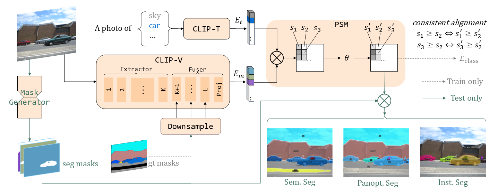

# MaskCLIP++: A Mask-Based CLIP Fine-tuning Framework for Open-Vocabulary Image Segmentation

## Introduction

This repo contains the code for our [paper](https://arxiv.org/abs/2412.11464).

**Abstract:** Open-vocabulary image segmentation has been advanced through the synergy between mask generators and vision-language models like Contrastive Language-Image Pre-training (CLIP). Previous approaches focus on generating masks while aligning mask features with text embeddings during training. In this paper, we observe that relying on generated low-quality masks can weaken the alignment of vision and language in regional representations. This motivates us to present a new fine-tuning framework, named MaskCLIP++, which uses ground-truth masks instead of generated masks to enhance the mask classification capability of CLIP. Due to the limited diversity of image segmentation datasets with mask annotations, we propose incorporating a consistency alignment constraint during fine-tuning, which alleviates categorical bias toward the fine-tuning dataset. After low-cost fine-tuning, combining with the mask generator in previous state-of-the-art mask-based open vocabulary segmentation methods, we achieve performance improvements of +1.7, +2.3, +2.1, +3.1, and +0.3 mIoU on the A-847, PC-459, A-150, PC-59, and PAS-20 datasets, respectively.

<div style="display: flex; justify-content: center; align-items: center; flex-direction: column; text-align: center; position: relative;">
  
  <div style="font-size: 12px; color: gray; margin-top: 10px;">Simplified framework for MaskCLIP++</div>
</div>


## Installation

See [installation instructions](INSTALL.md).

## Preparations

### Datasets

See [Preparing Datasets for MaskCLIP++](datasets/README.md).

### Pretrained CLIP models

The pre-trained CLIP model we used is as follows. If the `path` column is given, it is required to manually download the model to the corresponding relative path.

|         name          |                                                weights                                       |     path      |
|:---------------------:|:--------------------------------------------------------------------------------------------:|:-------------:|
| clip-convnext-base    | [url](https://huggingface.co/laion/CLIP-convnext_base_w_320-laion_aesthetic-s13B-b82K-augreg) |      -        |
| clip-convnext-large   | [url](https://huggingface.co/laion/CLIP-convnext_large_d_320.laion2B-s29B-b131K-ft-soup)      |      -        |
| clip-convnext-xxlarge | [url](https://huggingface.co/laion/CLIP-convnext_xxlarge-laion2B-s34B-b82K-augreg-soup)       |      -        |
| eva-clip-vit-b-16     | [url](https://huggingface.co/QuanSun/EVA-CLIP/blob/main/EVA02_CLIP_B_psz16_s8B.pt)            |`pretrained/eva_clip/EVA02_CLIP_B_psz16_s8B.pt`       |
| eva-clip-vit-l-14-336 | [url](https://huggingface.co/QuanSun/EVA-CLIP/blob/main/EVA02_CLIP_L_336_psz14_s6B.pt)        |`pretrained/eva_clip/EVA02_CLIP_L_336_psz14_s6B.pt`   |
| eva-clip-vit-g-14-plus| [url](https://huggingface.co/QuanSun/EVA-CLIP/blob/main/EVA01_CLIP_g_14_plus_psz14_s11B.pt)   |`pretrained/eva_clip/EVA01_CLIP_g_14_plus_psz14_s11B.pt` |


### Mask generators

The mask generators we already support are as follows. If the `path` column is given, it is required to manually download the model to the corresponding relative path.

| name | weights |  path |
|:----:|:-------:|:-----:|
| Mask2Former (Swin-T) | [url](https://dl.fbaipublicfiles.com/maskformer/mask2former/coco/panoptic/maskformer2_swin_tiny_bs16_50ep/model_final_9fd0ae.pkl) | `output/ckpts/mask2former/coco/pan/maskformer2_swin_tiny_bs16_50ep_final_9fd0ae.pkl` |
| Mask2Former (Swin-L) | [url](output/ckpts/mask2former/coco/pan/maskformer2_swin_large_IN21k_384_bs16_100ep_final_f07440.pkl) | `output/ckpts/mask2former/coco/pan/maskformer2_swin_large_IN21k_384_bs16_100ep_final_f07440.pkl` |
| FC-CLIP (ConvNext-B) | [url](https://drive.google.com/file/d/1fSFPPTwxF-ekMxAmIo01ssdbC79wwwml/view?usp=drive_link) | `output/ckpts/fcclip/fcclip_coco-pan_clip-convnext-base.pth`  |
| FC-CLIP (ConvNeXt-L) | [url](https://drive.google.com/file/d/1-91PIns86vyNaL3CzMmDD39zKGnPMtvj/view?usp=sharing) | `output/ckpts/fcclip/fcclip_coco-pan_clip-convnext-large.pth` |
| MAFTP-B              | [url](https://drive.google.com/file/d/1BeEeKOnWWIWIH-QWK_zLhAPUzCOnHuFG/view?usp=sharing) | `output/ckpts/maftp/maftp_b.pth` |
| MAFTP-L              | [url](https://drive.google.com/file/d/1EQo5guVuKkSSZj4bv0FQN_4X9h_Rwfe5/view?usp=sharing) | `output/ckpts/maftp/maftp_l.pth` |


### MaskCLIP++ models

#### (i) Finetuned on COCO-Stuff

> Use mask generators from MAFTP. Eval on 5 datasets.

| config | ckpt | A-847 | PC-459 | A-150 | PC-59 | PAS-20 |
|:------:|:------:|:------:|:------:|:------:|:------:|:------:|
| [clip-convnext-base](configs/coco-stuff/clip-convnext-base/maft-b/maskclippp_coco-stuff_clip-convnext-base_maft-b_ens.yaml) | [url](https://drive.google.com/file/d/1SekxdQPCMXLaAd8mM0P20DbHKhtIYL3u/view?usp=drive_link) | 14.5 | 18.7 | 35.4 | 59.1 | 95.8 |
| [eva-clip-vit-l-14-336](configs/coco-stuff/eva-clip-vit-l-14-336/maft-l/maskclippp_coco-stuff_eva-clip-vit-l-14-336_wtext_maft-l_ens.yaml) | [url](https://drive.google.com/file/d/1I5SiU5S-BjgoGU73ndocg-e2jo80mP1n/view?usp=drive_link) | 16.8 | 23.9 | 38.2 | 62.5 | 96.8 |

#### (ii) Finetuned on COCO-Panoptic

> Use mask generators from FC-CLIP. Eval on ADE20K.

| config | ckpt | mIoU | PQ | AP |
|:---:|:---:|:---:|:---:|:---:|
| [clip-convnext-base](configs/coco-pan/clip-convnext-base/fcclip-b/maskclippp_coco-pan_clip-convnext-base_fcclip-b.yaml)  | [url](https://drive.google.com/file/d/1lxlnxVICytERs1FsY5N7LdaoYDyenA1o/view?usp=drive_link) | 35.1 | 24.5 | 13.6 |
| [clip-convnext-large](configs/coco-pan/clip-convnext-large/fcclip-l/maskclippp_coco-pan_clip-convnext-large_fcclip-l.yaml) | [url](https://drive.google.com/file/d/1XMW3L2dOtlDQapydtoqTfzFVW-VZqcoX/view?usp=drive_link) | 35.6 | 26.5 | 16.7 |
| [clip-convnext-xxlarge](configs/coco-pan/clip-convnext-xxlarge/fcclip-l/maskclippp_coco-pan_clip-convnext-xxlarge_fcclip-l.yaml) | [url](https://drive.google.com/file/d/1LjVW7CNkvyFzxOW4rbgax1kmWY1lQ3f3/view?usp=drive_link) | 36.4 | 27.1 | 16.6 | 
| [eva-clip-vit-b-16](configs/coco-pan/eva-clip-vit-b-16/fcclip-b/maskclippp_coco-pan_eva-clip-vit-b-16_fcclip-b.yaml) | [url](https://drive.google.com/file/d/11n8VRcfaTsb7s7I3i7dlvq3Jy4GSgDr2/view?usp=drive_link) | 33.8 | 24.4 | 13.2 |
| [eva-clip-vit-l-14-336](configs/coco-pan/eva-clip-vit-l-14-336/fcclip-l/maskclippp_coco-pan_eva-clip-vit-l-14-336_fcclip-l.yaml) | [url](https://drive.google.com/file/d/1xMlDmgiVuShx-KWzLzOB-0_qvawIAa9m/view?usp=drive_link) | 36.6 | 27.3 | 17.0 |
| [eva-clip-vit-g-14-plus](configs/coco-pan/eva-clip-vit-g-14-plus/fcclip-l/maskclippp_coco-pan_eva-clip-vit-g-14-plus_fcclip-l.yaml) | [url](https://drive.google.com/file/d/1hCj0eZdTKbt5DusULFGBk3Bk8bxUGGm-/view?usp=drive_link) | 36.8 | 27.7 | 17.1 |

## Usage

### Evaluation

```bash
source eval_all.sh
eval_ade150 $config $ckpt $ngpu $tag
# $ngpu is an integer representing the number of GPUs in use.
# $tag is the name of a run.
# Other options include: eval_ade847, eval_ctx459, eval_ctx59, eval_pc20
```

### Fine-tuning

For base/large sized CLIPs, the fine-tuning requires about 2-4 hours on two 3090s (2x24G memory).

```bash
python train_maskclippp.py \
    --config-file $config \
    --num-gpus $ngpu \
    --dist-url "auto" \
    --tag $tag \
    WANDB.ENABLED True
```

## Citing MaskCLIP++
```
@article{zeng2024maskclip++,
  title={MaskCLIP++: A Mask-Based CLIP Fine-tuning Framework for Open-Vocabulary Image Segmentation},
  author={Zeng, Quan-Sheng and Li, Yunheng and Zhou, Daquan and Li, Guanbin and Hou, Qibin and Cheng, Ming-Ming},
  journal={arXiv preprint arXiv:2412.11464},
  year={2024}
}
```


## Acknowledgement

Thanks to the following open source code and models:

- [OpenCLIP](https://github.com/mlfoundations/open_clip)
- [EVA](https://github.com/baaivision/EVA)
- [Mask2Former](https://github.com/facebookresearch/Mask2Former)
- [FC-CLIP](https://github.com/bytedance/fc-clip)
- [MAFT+](https://github.com/jiaosiyu1999/MAFT-Plus)
